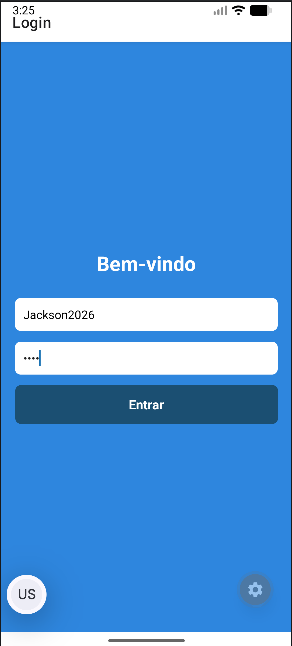
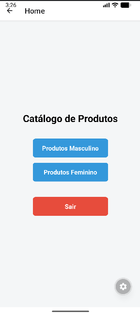
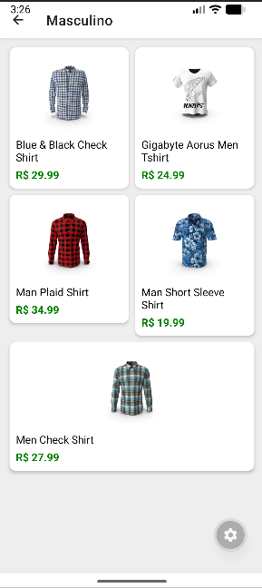
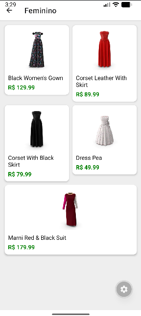
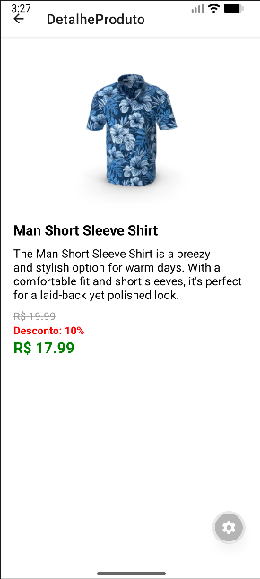
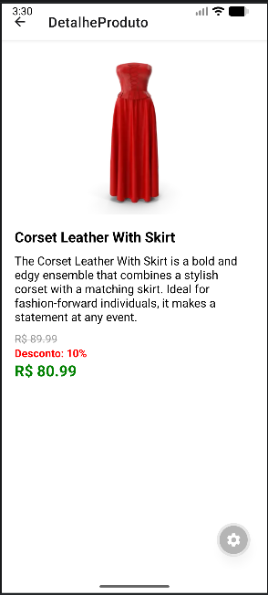

# 📱 Catálogo de Produtos – React Native

Aplicativo mobile desenvolvido com **React Native (Expo)** para exibição de um catálogo de produtos com autenticação simples, listagem por categoria e visualização detalhada.

## 📚 Projeto acadêmico

Disciplina: Desenvolvimento Mobile - UniFecaf
Tecnologias obrigatórias: **React Native, Expo, Axios e Redux Toolkit**

---

# 🚀 Funcionalidades

✔ Tela de Login com usuário e senha
✔ Navegação entre telas
✔ Listagem de produtos via API
✔ Separação por categorias:

* Masculino
* Feminino

✔ Grid de produtos
✔ Tela de detalhes do produto
✔ Cálculo de desconto
✔ Logout para retornar ao login

---

# 🧠 Tecnologias utilizadas

* React Native
* Expo
* Axios
* Redux Toolkit
* React Navigation

---

# 📡 API utilizada

Fake API

https://dummyjson.com

---

# 📂 Estrutura do projeto

src
├── components
│   └── ProductCard.js
│
├── redux
│   ├── store.js
│   └── productSlice.js
│
├── screens
│   ├── LoginScreen.js
│   ├── HomeScreen.js
│   ├── MasculinoScreen.js
│   ├── FemininoScreen.js
│   └── ProductDetailScreen.js
│
└── services
    └── api.js

---

# ▶ Como executar o projeto

1️⃣ Instalar dependências

npm install

2️⃣ Iniciar o projeto

npx expo start

3️⃣ Abrir no navegador ou celular com Expo Go

---

# 📸 Telas do aplicativo

### 🔐 Tela de Login

---

### 🏠 Tela Home

---

### 👕 Produtos Masculinos

---

### 👗 Produtos Femininos

---

### 📦 Detalhe do Produto

---

# 👨‍💻 Autor

Jackson Sousa
ADS - UniFecaf
RA: 96045
